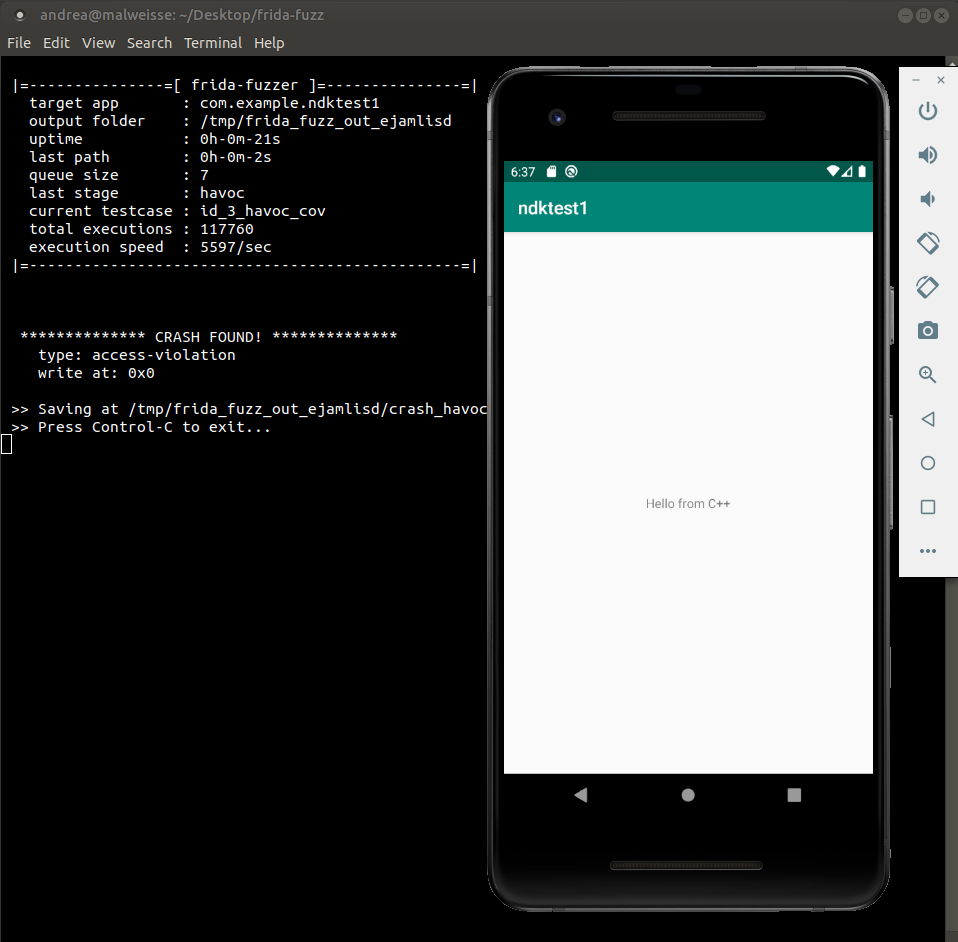

# Frida API Fuzzer

### WARNING: you need the lastest Frida compiled from git (not the PyPI version) to have this working.
### Thanks Ole for the fixes on the Stalker.
### You can also wait for the next Frida release, it will happen ASAP, stay tuned!

This experimetal fuzzer is meant to be used for API in-memory fuzzing.

The desing is highly inspired and based on AFL/AFL++.

ATM the mutator is quite simple, just the AFL's havoc stage and the seed selection
is simply FIFO (no favored paths, no trimming, no extra features).
Obviously these features are planned, if you want to contribute adding them PR
are well accepted.

I tested only on the two examples under tests/, this is a WIP project but is know to works at least on GNU/Linux x86_64 and Android x86_64.

## Usage

The `fuzz` library has to be imported into a custom harness and then compiled with `frida-compile` to generate the agent that `fuzzer.py` will inject into the target app.

The majority of the logic of the fuzzer is in the agent.

An harness has the following format:

```js
var fuzz = require("./fuzz");

var TARGET_MODULE = "test_linux64";
var TARGET_FUNCTION = DebugSymbol.fromName("target_func").address;;
var RET_TYPE = "void";
var ARGS_TYPES = ['pointer', 'int'];

var func_handle = new NativeFunction(TARGET_FUNCTION, RET_TYPE, ARGS_TYPES, { traps: 'all' });

fuzz.target_module = TARGET_MODULE;

fuzz.fuzzer_test_one_input = function (payload, size) {

  func_handle(payload, size);

}
```

`fuzz.fuzzer_test_one_input` is mandatory. If you don't specify `fuzz.target_module`, all the code executed will be instrumented.

You can also set `fuzz.init_function` to a callback that will be called at the beginning of the fuzzing loop.

`fuzzer.py` accepts the following arguments:

<table>
    <tr>
        <td>-i FOLDER</td>
        <td>Folder with initial seeds</td>
    </tr>
    <tr>
        <td>-o FOLDER</td>
        <td>Output folder with intermediate seeds and crashes</td>
    </tr>
    <tr>
        <td>-U</td>
        <td>Connect to USB</td>
    </tr>
    <tr>
        <td>-script SCRIPT</td>
        <td>Script filename (default is fuzzer-agent.js)</td>
    </tr>
</table>

Running `fuzzer.py` you will see somthing like the following status screen on your terminal:

```

 |=---------------=[ frida-fuzzer ]=---------------=|
   target app       : 6103
   output folder    : /tmp/frida_fuzz_out_4ytgqst_
   uptime           : 0h-0m-3s
   last path        : 0h-0m-0s
   queue size       : 8
   last stage       : havoc
   current testcase : id_7_havoc_cov
   total executions : 87808
   execution speed  : 29242/sec
 |=------------------------------------------------=|

```

## Example

Firstly, install Frida on your host with `pip3 install frida` (it will be this, for now compile it from master).

Make sure to have root on your virtual device:

```
host$ adb root
```

Download the Android x86_64 frida-server from the repo release page and copy it
on the device under /data/local/tmp (use adb push).

Start a shell and run the frida-server:

```
device# cd /data/local/tmp
device# ./frida-server
```

Now install the test app tests/app-debug.apk using the drag & drop into the emulator window.

Then, open the app.

Compile the agent script wiht frida-compile:

```
host$ frida-compile -x tests/test_ndk_x64.js -o fuzzer-agent.js
```

Fuzz the `test_func` function of the libnative-lib.so library shipped with the test app
with the command:

```
host$ ./fuzzer.py -o output_folder/ com.example.ndktest1
```

Both interesting testcases and crashes are saved into output_folder.

Enjoy.



## TODO

Hey OSS community, there are a lot of TODOs if someone wants to contribute.

+ Java code fuzzing (should be easy, almost done)
+ splice stage (merge two testcase in queue and aplly havoc on it)
+ seed selection (explore schedule of AFL)
+ structural mutator (mutate bytes based on a grammar written in JSON)
+ CompareCoverage (sub-instrumentation profiling to bypass fuzzing roadblocks)
+ rewrite fuzzer.py in C with frida-core to be able to run all the stuffs on the mobile device

If you have doubt on one of this featues feel free to DM me on [Twitter](https://twitter.com/andreafioraldi).

For features proposals, there is the [Issues section](https://github.com/andreafioraldi/frida-fuzzer/issues).

